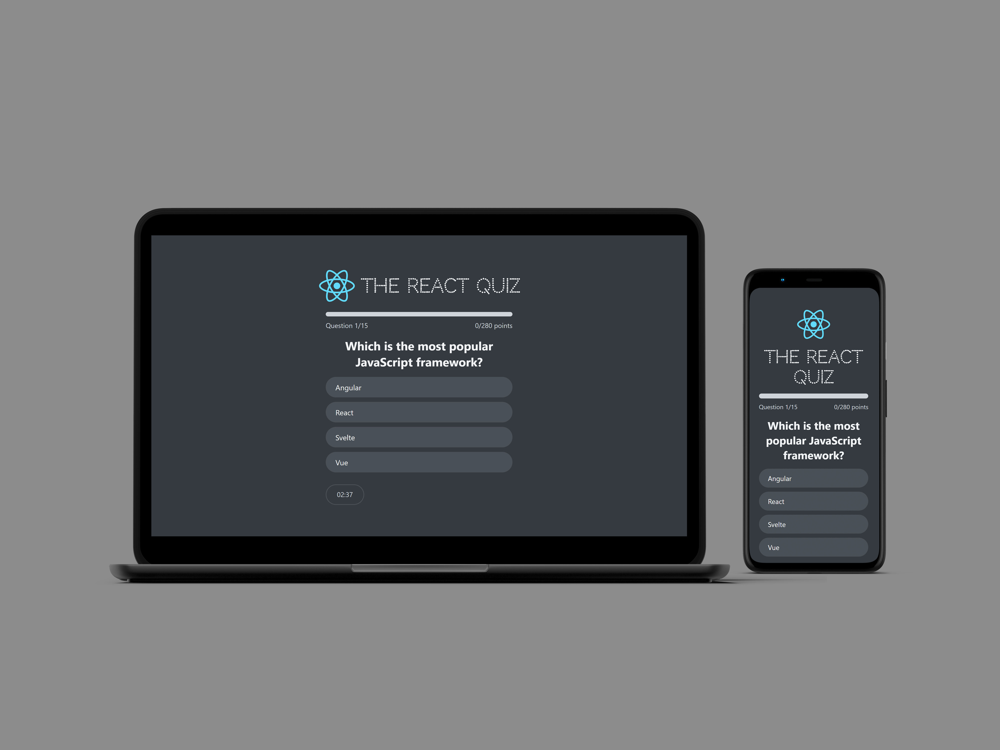

# **TakeQuiz: Interactive Quiz Application**

## Table of Contents

-   [Description](#description)
-   [KeyFeatures](#key-features)
-   [TechnicalHighlights](#technical-highlights)
-   [ProjectStructure](#project-structure)
-   [Conclusion](#conclusion)

**Live demo** [click here](https://take-quiz-react-app.netlify.app/)

---

### **Description:**

TakeQuiz is an engaging and dynamic quiz application developed using React.js. The app challenges users with timed quiz, creating an interactive experience that tests their knowledge. At the end of the quiz, users receive result of their performance, including their total score and percentage breakdown. The user can reset the quiz again to improve the highest score.

---

### **Key Features:**

1. **Timed Quiz:**

    - The quiz is displayed with a timer, encouraging quick thinking and engagement.

2. **Progress Tracking:**

    - A **progress bar** dynamically displays the current question number and total scored points out of the highest possible score.

3. **Performance Summary:**

    - After completing the quiz, users receive:
        - **Total Score**: Points earned during the quiz.
        - **Percentage Breakdown**: Percentage of correct answers.
        - **Highest Score**: Highest score during the session.
        - **Reset Button**: Play again to improve highest score.

4. **Interactive Gameplay:**
    - Users experience a seamless and responsive quiz interface with real-time updates.

---

### **Technical Highlights:**

-   **React Features:**

    -   **Context API:** Manages global state, including user progress and quiz data.
    -   **useReducer:** Handles complex state updates, such as score calculation and quiz navigation.
    -   **useEffect:** Manages side effects, including timers and state synchronization.
    -   **State Management:** Tracks question progress, timer, and score.

-   **User-Centric Design:**
    -   The intuitive progress bar and result summary enhance user engagement and provide clear feedback.

---

### **Conclusion:**

TakeQuiz showcases a perfect blend of React’s advanced features, delivering a smooth and interactive user experience. Its thoughtful design and implementation demonstrate expertise in state management, context usage, and dynamic UI updates.
